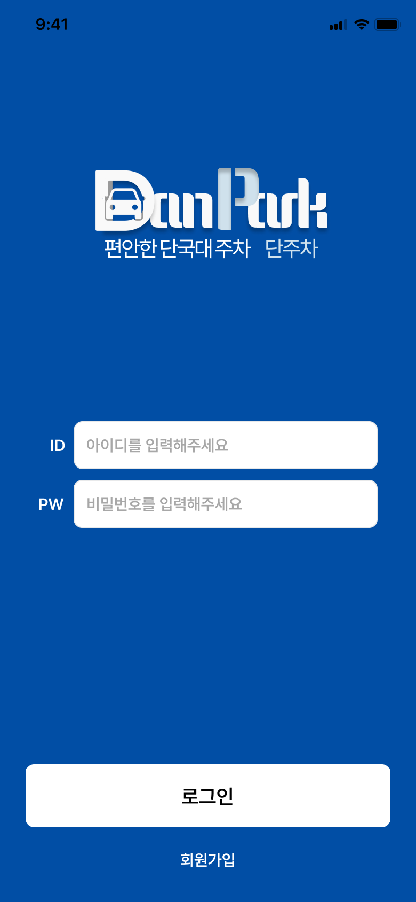
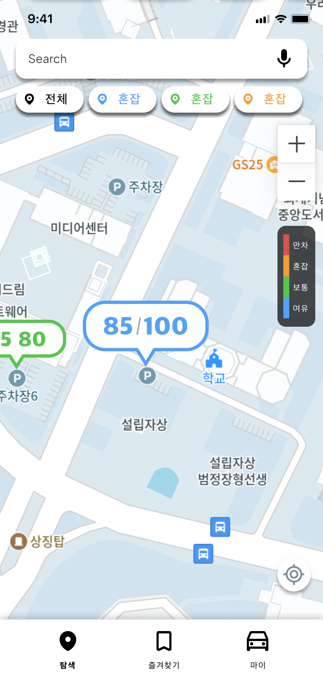
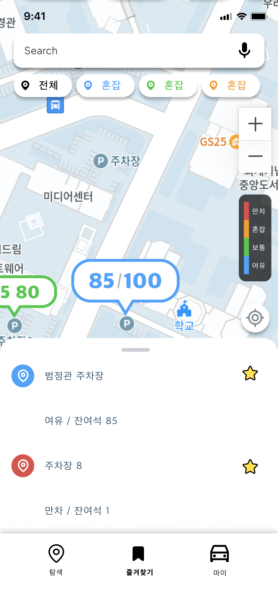
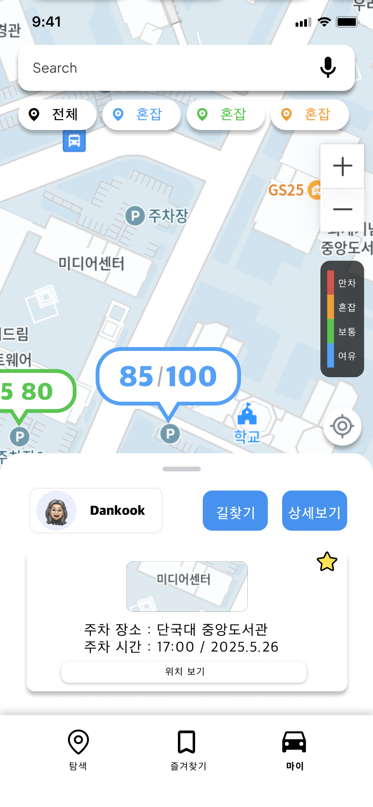
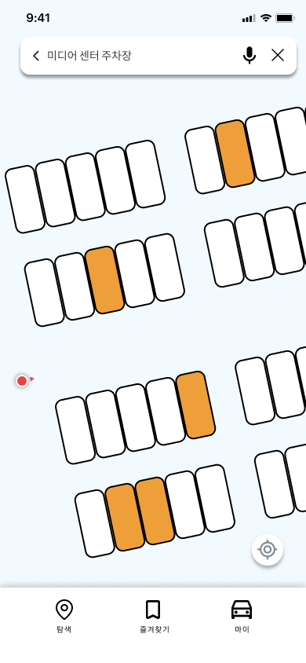
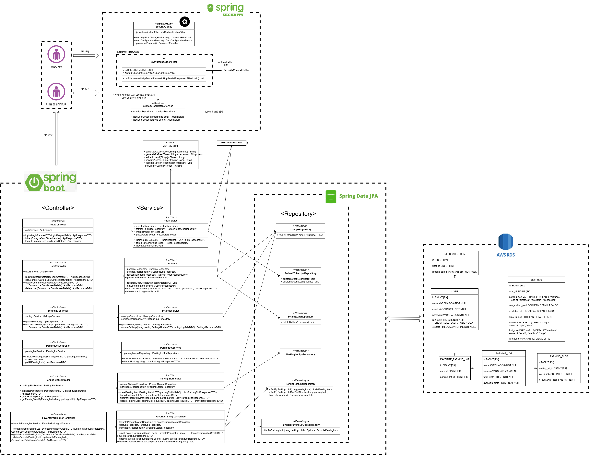

# 🚗 단주차: 캠퍼스 맞춤형 주차 안내 앱
> **단주차는 대학교 캠퍼스 내 주차 혼잡 문제를 해결하기 위해 개발된 실시간 주차 안내 앱입니다**
>
> 사용자의 위치 기반으로 주차 가능 공간을 빠르게 안내하고, 혼잡도를 시각화하여 보다 효율적인 주차를 도와줍니다.

  

---

## 📸 스크린샷

  
  
  
  
  
  
  
  

### 백엔드 아키텍처

  

### 프로젝트 전체 아키텍쳐

  

---

## 🎮 프로젝트 개요
차량으로 단국대학교를 방문한 모든 사용자에게 다음과 같은 기능을 제공합니다

-  **주차장 위치 안내**: 캠퍼스 내 모든 주차장의 위치와 정보를 확인할 수 있습니다.
-  **실시간 주차 현황**: YOLO 기반 차량 감지를 통해 실시간으로 남은 주차석을 제공합니다.
-  **즐겨찾기 등록**: 자주 사용하는 주차장을 즐겨찾기로 관리할 수 있습니다.
-  **자동 실행 기능**: 캠퍼스 반경 내 진입 시 앱이 자동으로 실행되어 주차장을 안내합니다.
-  **위치 기반 추천**: 현재 위치에서 가장 가까운 주차장을 우선 추천합니다.
-  **알림 시스템**: 혼잡도 및 주차장 진입 시 알림을 제공합니다

---

## 🛠 기술 스택

### 🎨 Frontend

### ⚙️ Backend

### 🎮 AI

### 🗄 Database & Infra

---

## 👥 기여자

- #### 김승호 – ERD설계, Backend API 개발, AWS EC2 & RDS 관리, ELK스택
- #### 김준원 - YOLO 모듈 설계 & 개발
- #### 유위창 - YOLO 모듈 설계 & 개발
- #### 현수민 - 기획, 디자인, Frontend 설계 & 개발
